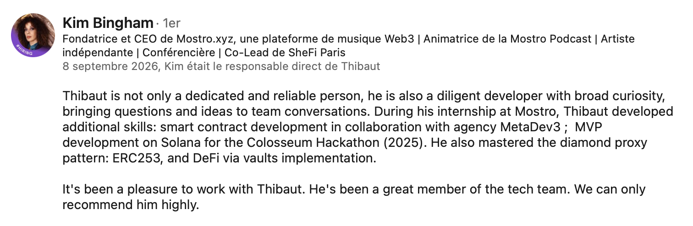
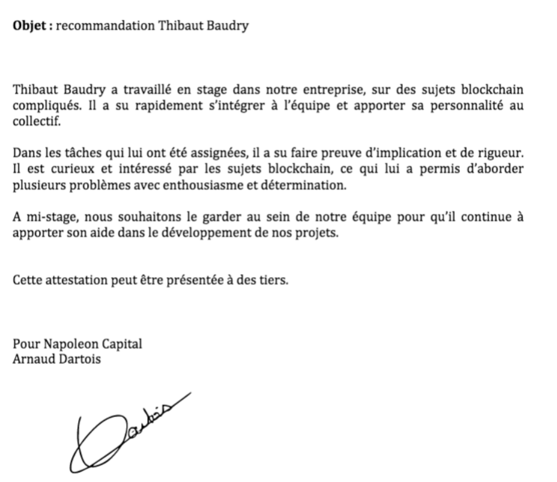

# Thibaut Baudry

Blockchain Engineer & FinTech graduate from **[ESILV](https://www.esilv.fr/)** — building **Solana programs, DeFi protocols and on-chain financial applications**.

Specialized in **Solana / Rust**, with experience across EVM smart contracts and DeFi infrastructure.

## Tech

**Solana:** Rust · Anchor · Token-2022 · SPL · PDAs · CPIs  
**EVM:** Solidity · Foundry · Hardhat · OpenZeppelin · ERC-4626 · Chainlink  
**ZK:** Circom · Groth16 · snarkjs  
**Backend:** Java · Spring Boot · TypeScript · Kafka · MySQL

## Current focus

### Solana Protocol Engineering

Currently deepening my work on **Solana protocol architecture and on-chain financial infrastructure**.

Main areas of interest:

- Solana account architecture & PDAs
- Anchor and native Solana concepts
- Token-2022
- On-chain markets and order books
- Compute optimization
- DeFi protocol design
- Smart contract security

## Featured projects

| Project | Description | Stack |
|---|---|---|
| [Mostro — Solana](https://github.com/4alls/Mostro_MVP_Program) | Solana protocol combining Token-2022, bonding curves and decentralized governance. | Rust, Anchor, Solana |
| [Mostro — EVM](https://github.com/mostrotech1-hash/mostro-evm) | Smart-contract infrastructure using modular architecture and DeFi mechanisms. | Solidity, Foundry, EIP-2535 |
| [Solana CLOB](https://github.com/4alls/Solana-mini-Orderbook) | On-chain Central Limit Order Book exploring price-time priority, escrow, order matching and Solana compute/account constraints. | Rust, Anchor |
| [Coup2Pousse](https://github.com/4alls/Coup2Pousse) | DeFi staking protocol built around ERC-4626 vaults, Chainlink pricing and programmable rewards. | Solidity, ERC-4626, Chainlink |

## Selected work

### Mostro

Blockchain protocol development across **Solana and EVM**.

On Solana, I have worked with **Rust, Anchor, Token-2022, PDAs, bonding curves and governance mechanisms**.

On EVM, my work includes **Solidity, Foundry, modular smart-contract architecture, vaults and governance mechanisms**.

### Solana CLOB

Experimental **Central Limit Order Book implemented on Solana** to explore how traditional financial market infrastructure can be adapted to Solana's execution model.

Implemented concepts include:

- Limit orders
- Price-time priority
- FIFO matching
- Escrow
- PDA-based state
- Order cancellation & refunds
- Anchor integration tests

The project is also used to explore **compute constraints, account architecture and protocol design trade-offs on Solana**.

### Coup2Pousse

DeFi protocol designed to connect **staking mechanisms with the financing of impact-oriented projects**.

The protocol explores the use of **ERC-4626 vaults and on-chain yield mechanisms** to build programmable financial infrastructure around project funding.

Implemented concepts include:

- ERC-4626 tokenized vaults
- Vault factory architecture
- ERC-20 staking
- Chainlink price feeds
- Programmable reward distribution
- Smart contract testing and gas reporting
- Sepolia deployment

The project combines **DeFi primitives, oracle infrastructure and smart contract architecture** within a real-world financing use case.

## Recommendations

### Kim Bingham — Founder & CEO @ Mostro

Recommendation following my work on **Solana, EVM smart contracts, ERC-2535 and DeFi vaults at Mostro**.

### Arnaud Dartois — CEO @ Napoleon Capital

Recommendation following my experience at **Napoleon Capital**.

## Other projects

| Project | Description | Stack |
|---|---|---|
| [ZK Credit Score](https://github.com/4alls/ZK-Credit-Score) | ZK credit system with Groth16 proofs, Solidity verification and replay protection. | Circom, Solidity |
| [PoW Blockchain](https://github.com/4alls/POW-Blockchain) | Experimental blockchain implementation exploring consensus and core blockchain mechanics. | Python |

## Background

**[ESILV](https://www.esilv.fr/) — Engineering Degree, FinTech**

**Alyra — Certified Blockchain Developer**

Experience across **Web3 startups, fintech, banking and venture capital**.

Open to work.

